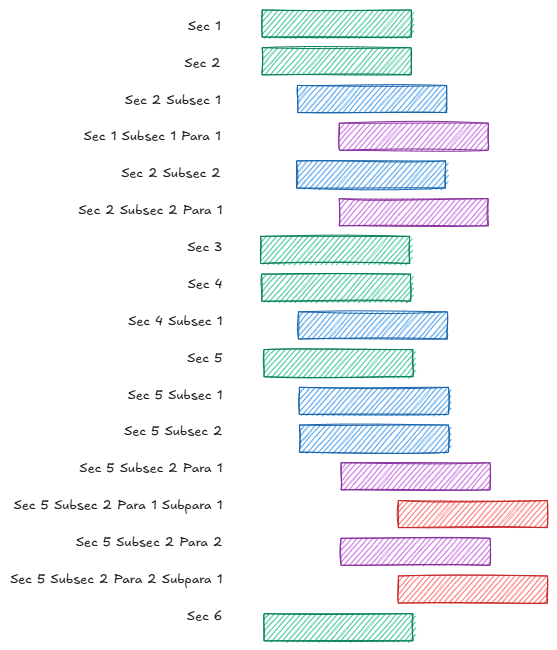
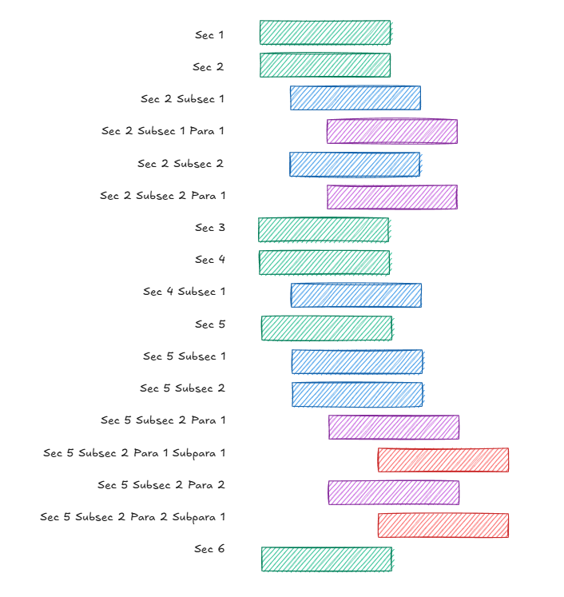
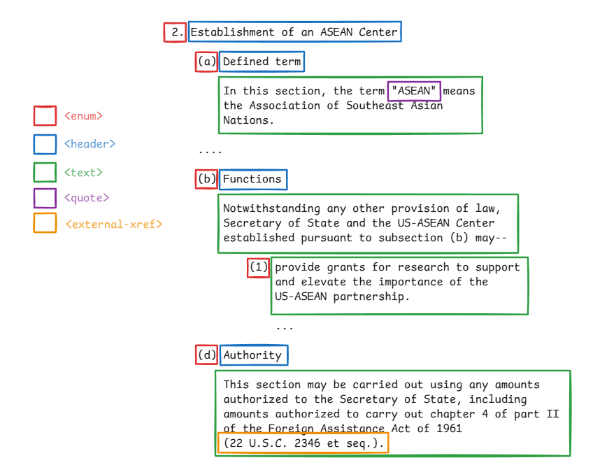

<style>
    .red-text {
    color: red;
  }
  .green-text {
    color: green;
  }
</style>

# LegisMatch

Recovering relationships between pieces of legsilation in Congress. Like a more sophisticated version of the "related bills" view on congress.gov, where the text contributing to the relationship is recoverable.

## Table of Contents
- [LegisMatch](#legismatch)
  - [Table of Contents](#table-of-contents)
  - [In brief](#in-brief)
    - [XML -\> DB Records](#xml---db-records)
    - [DB Records -\> Two-Stage Similarity](#db-records---two-stage-similarity)
    - [Records -\> Rendered Relationships](#records---rendered-relationships)
  - [In depth](#in-depth)
    - [Parsing XML](#parsing-xml)
    - [Parsing Text](#parsing-text)
    - [Text Normalization](#text-normalization)
    - [Candidate Selection vs. Detailed Comparison](#candidate-selection-vs-detailed-comparison)
    - [Rendering](#rendering)
    - [Misc Type Defs](#misc-type-defs)
  - [Notes](#notes)


## In brief
### XML -> DB Records
  1. Given some parameters, get bill XML.  
  2. Parse bill XML, splitting into sections.
  3. Leverage information encoded in nodes:  
    a. Mask text content of nodes that are unlikely to be useful.   
    b. Tag text content of nodes that are likely to be useful.
  4. Leverage additional text information not captured in XML schema, mask and tag again.
  5. Compute lookup vectors for each section, based on masked and tagged text and section header.
  6. Store data structure representing the parsed section alongside lookup vectors.
### DB Records -> Two-Stage Similarity
  1. Given section _S_, compute cosine similarities with all other sections.
  2. For each of _n_ highest cosine similarities, compute alignment score between sections.
  3. Store local alignment score payloads, linking target section _S_ to related sections _S1_, _S2_, ... _Sn_.
### Records -> Rendered Relationships
  1. Given a bill and section of interest.
  2. Retrieve related sections, sort by alignment scores.
  3. Focus one related section at a time, highlight shared local alignment regions, imputed across original text.
## In depth
### Parsing XML
Given some parameters, fetch bill XML.  

Every bill looks ~ like this:
   


Where each block is an XML node of a particular hierarchical level, and tabs denote parent <-> child relationships.

Briefly, let's distinguish between to types[^1] of XML nodes:

1. **Structure** nodes, which define the shape of the bill. E.g., title, section, subparagraph.
2. **Content** nodes, which define the text content of structure nodes, alongside some metadata. E.g., header, enunm, external-xref.

  We use **structure** nodes to collate legislative text up to a desired unit of analysis in the larger hierarchy of the bill. For us, this is the section level.  
     
   
  
We use **content** nodes to prepare text for similarity analysis. In general, preparing text takes one of two routes:  
  1. **Masking**, where the underyling text content is replaced with a special token. If text content is unlikely to be useful, or even misleading.
  2. **Tagging**, where the underlying text content is wrapped with special tokens, indicating sequence start and end. If the text content is likely to be useful, or even more meaningful than other unmasked text, we tag it.

Here's an example of a section from a bill, with some XML nodes pointed out:  
  


`<ENUM>` nodes are masked, meaning instead of
> (b) Functions notwithstanding any other provision of law...  
  
We get:
> <span class="green-text">MASK_ENUM</span> Functions notwithstanding any other provision of law...

`<EXTERNAL-XREF>` nodes are tagged, meaning instead of
> ...including amounts authorized to carry out chapter 4 of part II of the Foreign Assistance Act of 1961 (22 U.S.C. 2346 et seq.).
  
We get:
> ...including amounts authorized to carry out chapter 4 of part II of the Foreign Assistance Act of 1961 <span class="red-text">&lt;EXTERNAL-XREF&gt;</span>22 U.S.C. 2346 et seq.<span class="red-text">&lt;/EXTERNAL-XREF&gt;</span>.

In both cases, we preseve a data structure that allows us to (1) reverse any given mask or tagging decision, and (2) compose different masking and tagging pipelines. For the above transformations, it might look something like this:

```json
{
  "masks": [
    { "type": "ENUM", "original_text": "(b)" }
  ],
  "tags": [
    { 
      "type": "EXTERNAL-XREF", 
      "enclosed_text": "22 U.S.C. 2346 eq seq", 
      "legal_doc": "usc", 
      "parsable_cite": "usc/22/2346" 
    }
  ]
}
```

### Parsing Text
> *Note*: Section is a work in progress.
> - Setting this to the side for now, but acknowledging that it is a useful exercise, and that I have code written to get us part of the way, in other projects.
> - For now, I'm just going to see how the outputs look without this step.
> - If we're underperforming, or whenever I have time, I'll address this in two phases phases:
>   1.  Migrate my old code, drop in LLM's to mimic autogressive classifiers in blind spots. 
>   2. Then, if we're still underperforming, or if things are too expensive, I will actually go train the models to replace the LLM's.
> 
After we get all we can out of the XML nodes, we turn to the raw text content of the bill to do some additional masking and tagging. The intuition here is that there is information in the text it would be worthwhile to tag or mask, but the XML schema itself doesn't quite capture it. Here's an example:

**Amendatory instructions** are not denoted in the XML schema, but are likely to be useful in computing similarity. So, given the text:

> Section 402(b)(k)(1)(B) of title 37, United States Code, is amended-- (1) by striking "in" and all taht follows through "portion of"; and (2) by striking "that the Secretary concerned elects to exclude" and inserting "paid to such member".

Our current pipeline, which only leverages XML, returns:

> Section 402(b)(k)(1)(B) of title 37, United States Code, is amended-- <span class="green-text">MASK_ENUM</span> by striking <span class="red-text">&lt;QUOTE&gt;</span>in<span class="red-text">&lt;/QUOTE&gt;</span> and all that follows through <span class="red-text">&lt;QUOTE&gt;</span>portion of<span class="red-text">&lt;/QUOTE&gt;</span>; and <span class="green-text">MASK_ENUM</span> by striking <span class="red-text">&lt;QUOTE&gt;</span>that the Secretary concerned elects to exclude<span class="red-text">&lt;/QUOTE&gt;</span> and inserting <span class="red-text">&lt;QUOTE&gt;</span>paid to such member<span class="red-text">&lt;/QUOTE&gt;</span>.
With this associated payload:
```json
{
  "masks": [
    { "type": "ENUM", "original_text": "(1)" },
    { "type": "ENUM", "original_text": "(2)" }
  ],
  "tags": [
    { "type": "QUOTE", "enclosed_text": "in" },
    { "type": "QUOTE", "enclosed_text": "portion of" },
    { "type": "QUOTE", "enclosed_text": "that the Secretary concerned elects to exclude" },
    { "type": "QUOTE", "enclosed_text": "paid to such member" }
  ]
}
```

But we might prefer a return value that captures the operation associated with amendatory instruction, like this:

> Section 402(b)(k)(1)(B) of title 37, United States Code, is amended-- <span class="green-text">MASK_ENUM</span> by <span class="red-text">&lt;AMENDMENT_OP&gt;</span>striking<span class="red-text">&lt;/AMENDMENT_OP&gt;</span> <span class="red-text">&lt;/QUOTE&gt;</span>in<span class="red-text">&lt;QUOTE&gt;</span> and all that follows through <span class="red-text">&lt;QUOTE&gt;</span>portion of<span class="red-text">&lt;/QUOTE&gt;</span>; and by <span class="red-text">&lt;AMENDMENT_OP&gt;</span>striking<span class="red-text">&lt;/AMENDMENT_OP&gt;</span> <span class="red-text">&lt;QUOTE&gt;</span>that the Secretary concerned elects to exclude<span class="red-text">&lt;/QUOTE&gt;</span> and <span class="red-text">&lt;AMENDMENT_OP&gt;</span>inserting<span class="red-text">&lt;/AMENDMENT_OP&gt;</span> <span class="red-text">&lt;QUOTE&gt;</span>paid to such member<span class="red-text">&lt;/QUOTE&gt;</span>.

With a payload that stores this additional info, and associates the amendatory operation with a quote node alongside it in the tags field.

```json
{
  "masks": [
    { "type": "ENUM", "original_text": "(1)" },
    { "type": "ENUM", "original_text": "(2)" }
  ],
  "tags": [
    { "type": "AMENDMENT_OP", "enclosed_text": "striking" },
    { "type": "QUOTE", "enclosed_text": "in", "amendment_op": "strike" },
    { "type": "QUOTE", "enclosed_text": "portion of" },
    { "type": "AMENDMENT_OP", "enclosed_text": "striking" },
    { 
      "type": "QUOTE", 
      "enclosed_text": "that the Secretary concerned elects to exclude", 
      "amendatory_op": "strike" 
    },
    { "type": "AMENDMENT_OP", "enclosed_text": "inserting" }
    { "type": "QUOTE", "enclosed_text": "paid to such member", "amendment_op": "insert" },
  ]
}
```

Other candidates you might see appear in my codebase, particulary in some type definitions, are:
- Tags: `ENTITY`, `KEY_TERM`, `DEADLINE`, `EXTERNAL_XREF`[^2]
- Masks: `INTERNAL_XREF`, `DOLLAR_AMOUNT`, `DATE`
### Text Normalization
After parsing, we're left with a large data payload that represents the parsed section. The two key fields for this discussion are:
- `header`: The text content of the header of the section, with all masks and tags applied.
- `content`: The text content of the section, other than the header, with all masks and tags applied.

Before any actual similarity work can be done, we need to have normalized views of these two fields. Normalization pipeline is something like this:
1. Drop mask and tag special characters
2. Push to lowercase
3. Drop punctuation
4. Normalize whitespace
5. Drop stopwords
6. Lemmatize
7. Tokenize

### Candidate Selection vs. Detailed Comparison
At this point in the procedure, we have a database with a bunch of records representing parsed sections. If we want to compare any two sections-- to detect "similarity"-- we can go about it in two ways:  
  
1. **Sequence-based**, where the order of the words in the text matters. The traditional approach here (in political science literature, for recovering legislative text relationships) is to borrow an algorithm from bioinformatics, Smith-Waterman.[^3] This is often referred to as recovering "text reuse."

2. **Semantic-based**, where the order of the words in the text doesn't matter. The traditional approach here is to use a pre-trained model to project the text into a fixed-dimensional space (a word "embedding" vector), and then to compare the resulting vectors using cosine simliarity.

Other than their functional differences, there are two more important distinctions to make. 

First, sequence-based algorithms become significantly more expensive to compute as the number of comparisons grows, and as the length of the text being compared grows. Second, sequence-based algorithms operate directly on the original text, while semantic-based algorithms project the text into a semantically meaningful space, and operate on the resulting vectors.  

The latter distinction is one of the reasons we want to use the sequence-based approach. Not only is there support in the literature, but the outputs are plainly interpretable. Practically, this means they can be used to render useful metadata that describes the relationship at the word-level, either for sanity checking, or for presentation to a user.[^4] If we could just compare all-to-all sections using a sequence-based approach, we probably would. But the former distinction--the costs of computing-- is why we can't.

This breaks our procedure into two stages: using a semantic-based similarity to **select candidates** for comparison, then amongst those candidates, using a sequence-based approach to **compare in detail**.[^5]

Okay, with this intuition in hand, let's talk about what we're actually doing for each of these stages.

For candidate selection, we're going to use a pre-trained model to compute lookup vectors for the normalized version of each section's content and header. We'll store those vectors in the DB, alongside the rest of the payload. We can cheaply compute the cosine similarity between any two sections by with these vectors, and use this to select the _n_ most similar candidates.

For detailed comparison, we're going to use a special implementation of the Smith-Waterman algorithm. It generally follows the approach detailed in Wilkerson, 2015, but has two special modifications: (1) Its scoring heuristic is dynamically adjusted as it moves through the text to account for the presence of tagged regions, and (2) it produces a payload of positional data that can be used to render the aligned region between two sections in the original text, even though the alignment is computed over a normalized version of the text.  

These alignment outputs are stored in the DB as a link between the target section and _n_ related sections.

> _Note_: I recognize that sequence-based algorithms implicitly assume that small, even one-word changes, in otherwise highly similar regions of text are not singularly meaningful. And I recognize that this isn't the case in our domain, that small changes in language can produce radical changes in the function of law. But this approach also gives us traction on these kinds of changes, even if the approach as-is doesn't necessarily account for them in the scoring scheme, and doesn't plan to point them out.

### Rendering 
> *Note*: Section is a work in progress.
> Just going to post some scerenshots from papers here, I think they're decent starting points.  
> 
> Linder et al., 2020, p. 13:  
> 
>
> Wilkerson et al., 2015, p. 14:  
> 

### Misc Type Defs
```ts
interface ParsedSection {
  section_id: string;
  section_number: number;
  header: string;
  normalized_header: string;
  masks: [
    {
      type: MaskType;
      original_text: string;
      // Given some mask type, addional props:
      // type === "DOLLAR_AMOUNT" ? => plain_language_number: string;
      // type === "INTERNAL_XREF" ? => parsable_cite: string;
    }
  ];
  tags: [
    {
      type: TagType;
      enclosed_text: string;
      // Given some tag type, additional props:
      // type === "KEY_TERM" ? => object_responsible: string;
      // type === "EXTERNAL_XREF" ? => legal_doc: LegalDocAttributeType;
      // type === "EXTERNAL_XREF" ? => parsable_cite: string;
      // type === "ENTITY" ? => expanded_form: string;
      // type === "QUOTE" ? => amendatory_op: 'strike' | 'insert'
      // type === "QUOTE" ? => parsable_xref: string;
      // type === "QUOTED_BLOCK" ? => amendatory_op: 'strike' | 'insert'
      // type === "QUOTED_BLOCK" ? => parsable_xref: string;
    }
  ];
  output: string;
  normalized_output: string;
}

type MaskType =
  | "ENUM"

  // TODO
  | "INTERNAL_XREF"
  | "DOLLAR_AMOUNT"
  | "DATE";

type TagType =
  | "QUOTE"
  | "EXTERNAL_XREF"
  | "QUOTED-BLOCK"

  // TODO
  | "ENTITY"
  | "KEY_TERM"
  | "DEADLINE";

type LegalDocAttributeType =
  // for us, almost always these 3
  | "usc"
  | "public-law"
  | "statute-at-large"

  // but other values possible
  | "bill"
  | "act"
  | "executive-order"
  | "regulation"
  | "senate-rule"
  | "house-rule"
  | "treaty-ust"
  | "treaty-tias"
  | "usc-appendix"
  | "usc-act"
  | "usc-chapter"
  | "usc-subtitle";
```

## Notes
[^1]: My terminology, not actually part of the XML schema. I.e., there is no attribute on these nodes that indicates they are part of the structure family, as opposed to the content family.    
[^2]: Note that while `<EXTERNAL-XREF>` nodes are osetinsbly captured in the XML schema, that isn't exhaustive. For instance, the section section of XML I walked through in the "Parsing XML" section doesn't wrap the text specifying the target of its amendatory instruction, "Section 402(b)(k)(1)(B) of title 37, United States Code," in an `<EXTERNAL-XREF>` node.  
[^3]: See, e.g, [Wilkerson et al., 2015](resources/Wilkerson_2015.pdf), [Linder et al., 2020](resources/Linder_2020.pdf).  
[^4]: While it is true that sequence-based approaches are almost always more interpretable, this isn't an either-or situation. There are ways to recover data out of semantic-based approaches. But quite frankly I only know about them in theory, and have never done any implementation. Alternatively, we could just say recovery and interpretability of the data isn't important to us.  
[^5]: This is a very common approach in IR, and both papers cited above use it. In Wilkerson, 2015, they only compute alignment scores between sections that share 5 10-grams (p. 41). In Linder, 2020, they use an off-the-shelf solution, ElasticSearch's "more like this" query option (pp. 43-44).