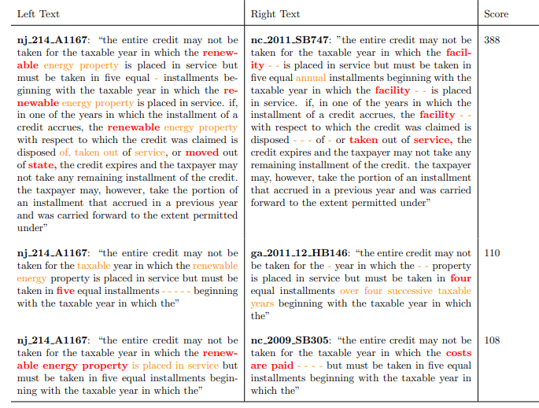
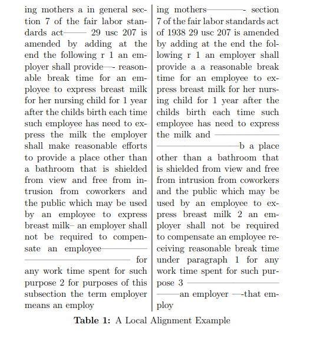

# LegisMatch

Recovering relationships between pieces of legsilation in Congress. Like a more sophisticated version of the "related bills" view on congress.gov, where the text contributing to the relationship is recoverable.

## Table of Contents
- [LegisMatch](#legismatch)
  - [Table of Contents](#table-of-contents)
  - [In brief](#in-brief)
    - [XML -\> DB Records](#xml---db-records)
    - [DB Records -\> Two-Stage Similarity](#db-records---two-stage-similarity)
    - [Records -\> Rendered Relationships](#records---rendered-relationships)
  - [In depth](#in-depth)
    - [Parsing XML](#parsing-xml)
    - [Parsing Text](#parsing-text)
    - [Text Normalization](#text-normalization)
    - [Computing Lookup Vectors](#computing-lookup-vectors)
    - [Computing Alignment Scores](#computing-alignment-scores)
  - [Notes](#notes)


## In brief
### XML -> DB Records
  1. Given some parameters, get bill XML.  
  2. Parse bill XML, splitting into sections.
  3. Leverage information encoded in nodes:  
    a. Mask text content of nodes that are unlikely to be useful.   
    b. Tag text content of nodes that are likely to be useful.
  4. Leverage additional text information not captured in XML schema, repeating masking and tagging.
  5. Compute lookup vectors for each section, based on masked and tagged text and section header.
  6. Store data structure representing the parsed section alongside lookup vectors.
### DB Records -> Two-Stage Similarity
  1. Given section _S_, compute cosine similarities with all other sections.
  2. For each of _n_ highest cosine similarities, compute local alignment similarity between sections and headers.
  3. Store local alignment similarity payloads, linking target section _S_ to related sections _S1_, _S2_, ... _Sn_.
### Records -> Rendered Relationships
  1. Given a bill and section of interest.
  2. Retrieve related sections, sort by alignment scores.
  3. Focus one related section at a time, highlight shared local alignment regions.
## In depth
### Parsing XML
Given some parameters, fetch bill XML.  

Every bill looks ~ like this:
   


Where each block is an XML node of a particular hierarchical level, and tabs denote parent <-> child relationships.

Briefly, let's distinguish between to types[^1] of XML nodes:

1. **Structure** nodes, which define the shape of the bill. E.g., title, section, subparagraph.
2. **Content** nodes, which define the text content of structure nodes, alongside some metadata. E.g., header, enunm, external-xref.

  We use **structure** nodes to collate legislative text up to a desired unit of analysis in the larger hierarchy of the bill. For us, this is the section level.  
     
   
  
We use **content** nodes to prepare text for similarity analysis. In general, preparing text takes one of two routes:  
  1. **Masking**, where the underyling text content is replaced with a special token. If text content is unlikely to be useful, or even misleading.
  2. **Tagging**, where the underlying text content is wrapped with special tokens, indicating sequence start and end. If the text content is likely to be useful, or even more meaningful than other unmasked text, we tag it.

Here's an example of a section from a bill, with some XML nodes pointed out:  
  


`<ENUM>` nodes are masked, meaning instead of
> (b) Functions notwithstanding any other provision of law...  
  
We get:
> MASK_ENUM Functions notwithstanding any other provision of law...

`<EXTERNAL-XREF>` nodes are tagged, meaning instead of
> ...including amounts authorized to carry out chapter 4 of part II of the Foreign Assistance Act of 1961 (22 U.S.C. 2346 et seq.).
  
We get:
> ...including amounts authorized to carry out chapter 4 of part II of the Foreign Assistance Act of 1961 \<EXTERNAL-XREF\>22 U.S.C. 2346 et seq.\<EXTERNAL-XREF\>.

In both cases, we preseve a data structure that allows us to (1) reverse any given mask or tagging decision, and (2) compose different masking and tagging pipelines. For the above transformations, it might look something like this:

```json
{
  "masks": [
    { "type": "ENUM", "original_text": "(b)" }
  ],
  "tags": [
    { 
      "type": "EXTERNAL-XREF", 
      "enclosed_text": "22 U.S.C. 2346 eq seq", 
      "legal_doc": "usc", 
      "parsable_cite": "usc/22/2346" 
    }
  ]
}
```

### Parsing Text
> *Note*: Section is a work in progress.
> - Setting this to the side for now, but acknowledging that it is a useful exercise, and that I have code written to get us part of the way, in other projects.
> - For now, I'm just going to see how the outputs look without this step.
> - If we're underperforming, or whenever I have time, I'll address this in two phases phases:
>   1.  Migrate my old code, drop in LLM's to mimic autogressive classifiers in blind spots. 
>   2. Then, if we're still underperforming, or if things are too expensive, I will actually go train the models to replace the LLM's.
> 
After we get all we can out of the XML nodes, we turn to the raw text content of the bill to do some additional masking and tagging. The intuition here is that there is information in the text it would be worthwhile to tag or mask, but the XML schema itself doesn't quite capture it. Here's an example:

**Amendatory instructions** are not denoted in the XML schema, but are likely to be useful in computing similarity. So, given the text:

> Section 402(b)(k)(1)(B) of title 37, United States Code, is amended-- (1) by striking "in" and all taht follows through "portion of"; and (2) by striking "that the Secretary concerned elects to exclude" and inserting "paid to such member".

Our current pipeline, which only leverages XML, returns:

> Section 402(b)(k)(1)(B) of title 37, United States code, is amended-- MASK_ENUM by striking \<QUOTE\>in\<QUOTE\> and all that follows through \<QUOTE\>portion of\</QUOTE\>; and MASK_ENUM by striking \<QUOTE\>that the Secretary concerned elects to exclude\</QUOTE\> and inserting \<QUOTE\>paid to such member\</QUOTE\>.
>
With this associated payload:
```json
{
  "masks": [
    { "type": "ENUM", "original_text": "(1)" },
    { "type": "ENUM", "original_text": "(2)" }
  ],
  "tags": [
    { "type": "QUOTE", "enclosed_text": "in" },
    { "type": "QUOTE", "enclosed_text": "portion of" },
    { "type": "QUOTE", "enclosed_text": "that the Secretary concerned elects to exclude" },
    { "type": "QUOTE", "enclosed_text": "paid to such member" }
  ]
}
```

But we might prefer a return value that captures the operation associated with amendatory instruction, like this:

> Section 402(b)(k)(1)(B) of title 37, United States code, is amended-- MAKS_ENUM by \<AMENDMENT_OP\>striking\
></AMENDMENT_OP\> \</QUOTE\>in\<QUOTE\> and all that follows through \<QUOTE\>portion of\<QUOTE\>; and by \<AMENDMENT_OP>striking\</AMENDMENT_OP\> \<QUOTE\>that the Secretary concerned elects to exclude\<QUOTE\> and \<AMENDMENT_OP>inserting\</AMENDMENT_OP\> \<QUOTE\>paid to such member\<QUOTE\>.

With a payload that stores this additional info, and associates the amendatory operation with a quote node alongside it in the tags field.

```json
{
  "masks": [
    { "type": "ENUM", "original_text": "(1)" },
    { "type": "ENUM", "original_text": "(2)" }
  ],
  "tags": [
    { "type": "AMENDMENT_OP", "enclosed_text": "striking" },
    { "type": "QUOTE", "enclosed_text": "in", "amendment_op": "strike" },
    { "type": "QUOTE", "enclosed_text": "portion of" },
    { "type": "AMENDMENT_OP", "enclosed_text": "striking" },
    { 
      "type": "QUOTE", 
      "enclosed_text": "that the Secretary concerned elects to exclude", 
      "amendatory_op": "strike" 
    },
    { "type": "AMENDMENT_OP", "enclosed_text": "inserting" }
    { "type": "QUOTE", "enclosed_text": "paid to such member", "amendment_op": "insert" },
  ]
}
```

Other candidates you might see appear in my codebase, particulary in some type definitions, are:
- Tags: `ENTITY`, `KEY_TERM`, `DEADLINE`
- Masks: `INTERNAL_XREF`, `DOLLAR_AMOUNT`, `DATE`
### Text Normalization

### Computing Lookup Vectors
After parsing, we're left with a that represents the parsed section. Two key fields, for the discussion in this section, are:


### Computing Alignment Scores


## Notes
[^1]: My terminology, not actually part of the XML schema. I.e., there is no attribute on these nodes that indicates they are part of the structure family, as opposed to the content family.